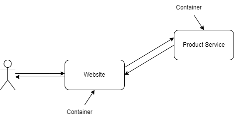

# Smart Website Design with Docker Container

## Inhaltsverzeichniss

1. [Service Beschreibung](#service-beschreibung)
2. [Service Anwendung](#service-anwendung)
2. [Grafische Übersicht des Service](#grafische-übersicht-des-service)
4. [Code Beschreibung](#code-beschreibung)
5. [Service Testen](#service-testen)
6. [Quellenangaben](#quellenangaben)

 

## [Service Beschreibung](#service-beschreibung)

Traditionell ist eine große Website wie ein Online-Shop eine große Anwendung, aber ein neuerer Trend besteht darin, diese großen Anwendungen in kleinere **Mikrodienste** aufzuteilen. Die Website kann dann ziemlich minimal sein und macht einfach Aufrufe zu andere Dienste, um Informationen zu erhalten oder um sie zu bitten eine Arbeit zu erledigen. 

In diesem Projekt verwendet die Website eine API für den Produktdienst, um die Liste der Produkte anzufordern, die dem Kunden gezeigt werden sollen. Wichtig ist hierbei, dass man nur einen Prozess pro Container haben sollte, daher wird ein Container benötigt, auf dem die Website ausgeführt wird, und ein Container, auf dem der Produktdienst ausgeführt wird. Sie sollten unabhängig sein. Dies bedeutet, dass sie in verschiedenen Sprachen geschrieben werden können, aber sie müssen in der Lage sein, miteinander zu sprechen.
 

## [Service Anwendung](#service-anwendung)
1. Clonen sie das Repository in eine Linuxmaschine. (`git clone https://github.com/niccas95/M300-Services.git`)

2. Öffnen sie ihr Terminal.

3. Navigieren sie in den Ordner lb3. (`cd ./M300-Services/lb3`)

4. Werden sie Root im Terminal. (`sudo su`)

5. Starten sie das Custom-Image mit: `docker-compose up`

6. Öffen sie ihren Browser.

7. Geben sie die IP ihres Haupt-Containers in die Suchleiste mit dem Port 5000: `localhost:5000`

8. Wenn sie nun auf die *Diggitec* Shop Website gelangen, haben sie den Service **erfolgreich aufgesetzt**.
 

## [Grafische Übersicht des Service](#grafische-übersicht-des-service)

*User (Strichmänchen) spricht mit der Hauptwebsite, diese spricht mit dem Product Service. Haupt und Produktbackend sind Container unter Docker.*
 

## [Code Beschreibung](#code-beschreibung)

### Content

[api.py](https://github.com/niccas95/M300-Services/blob/main/lb3/content/api.py) 
In diesem File wird Hauptsächlich der Inahlt der Produkte spezifiziert und anschliessend auf dem Port 5001 für die Hauptseite freigegeben. 
Sie können im File direkt die Produkte (Zeile 19) editieren. Wenn sie dann das File abspeicher werden die Änderungen direkt auf die Website übernommen.

[Dockerfile](https://github.com/niccas95/M300-Services/blob/main/lb3/content/Dockerfile) 
Im Dockerfile wird spezifiziert, was beim Aufsetzten passieren soll. In diesem Fall wird ein Base Image installiert und anschliessend ein Command ausgeführt. Wenn sie können hier neue Befehle hinzufügen Falls sie das Projekt erweitern möchten.

### main-page

[index.php](https://github.com/niccas95/M300-Services/blob/main/lb3/main-page/index.php) 
In diesem File wird vor allem die Website erstellt mit normalem HTML. Hier werden auch die Daten des [api.py](https://github.com/niccas95/M300-Services/blob/main/lb3/content/api.py) File mithilfe von JSON eingefügt. Falls man die Website verändern möchte, kann man das in diesem File machen.

### [docker-compose.yml](https://github.com/niccas95/M300-Services/blob/main/lb3/docker-compose.yml) 
In diesem File werden die Services spezifiziert. In unserem Fall sind es zwei Services, einmal die Website (Website) und ein anderes mal die Liste mit Produkten (product-service).  
Wenn sie folgenden Command im Linux Terminal im lb3 Folder mit root rechten eingeben, können sie den product service stoppen und somit wird nur die Website ohne List angezeigt: `docker stop (service ID des product-service containers)`
 

## [Service Testen](#service-testen)

|Thema|Ja|Nein|Bemerkung|
|--------|--------|--------|--------|
|Include Libraries  funktioniert|X||Wir verwenden eine etwas alte Version von PIP|
|Application hört auf Port 80 ab|X|||
|Map Port to 5001 on host funktioniert|X|||
|Docker-compose startet containers (application/services) displayed als Images|X|||
|Localhost:5001 zeigt  webpage (product array) from [api.py](https://github.com/niccas95/M300-Services/blob/main/lb3/content/api.py)|X|||
|Website (in php) depends on product-service from [api.py](https://github.com/niccas95/M300-Services/blob/main/lb3/content/api.py), array of products wird richtig intepretiert|X|||
|Website läuft auf apache webserver|X|||
|Image of product-service & php:apache “running” nach Ausführung von docker-compose up|X|||
|Import Framework Flask, Resource & Api erfolgreich included|X|||
|[Api.py](https://github.com/niccas95/M300-Services/blob/main/lb3/content/api.py) run on localhost, erreichbar auf Port 5001|X||Je nach Setup muss die IP des Containers angegeben werden|
|Website gespeichert unter ./website:/var/www/html|X|||
|Docker-compose.yml  website “depends on” product-service|X|||
|Foreach loop führt Output von allen products in $products  file, listed in individual < li> items of a list|X|||
| Title displayed auf Website|X|||
| < ul>< /ul> eingesetzt, um zusätzliche Formatierung von php code (Products listed from $products in foreach loop) zu verhindern|X|||
 

## [Quellenangaben](#quellenangaben)

|Thema|Quellen|
|--------|--------|
|Python|https://youtu.be/MF75aNH3Gjs|
|PHP|https://www.makeuseof.com/tag/build-simple-php-website/#:~:text=To%20create%20a%20website%20using%20PHP%2C%20you'll%20need%20to,use%2C%20along%20with%20CSS%20references.|